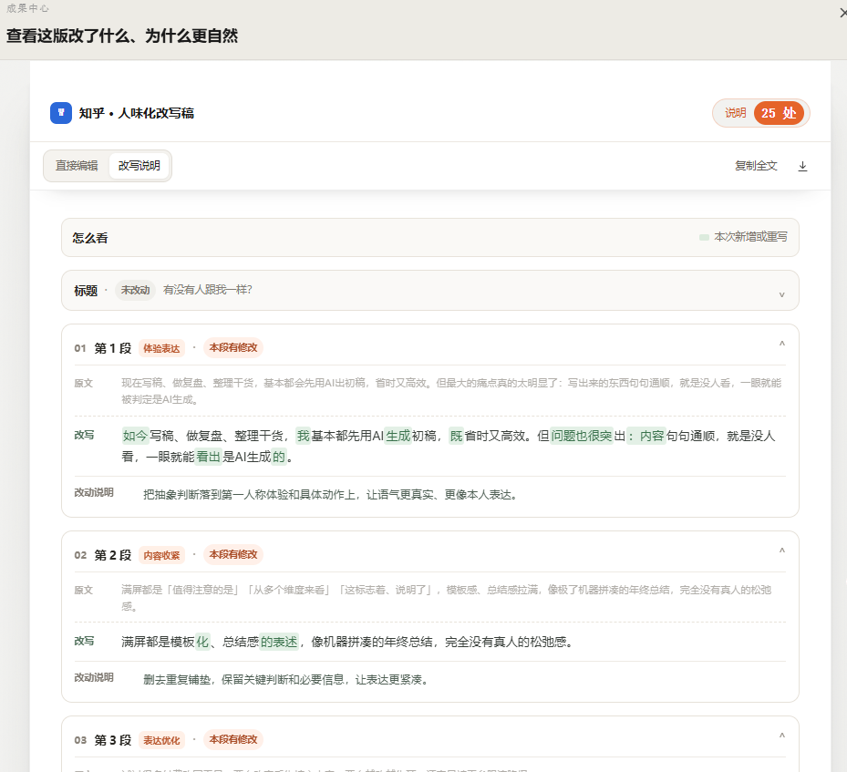
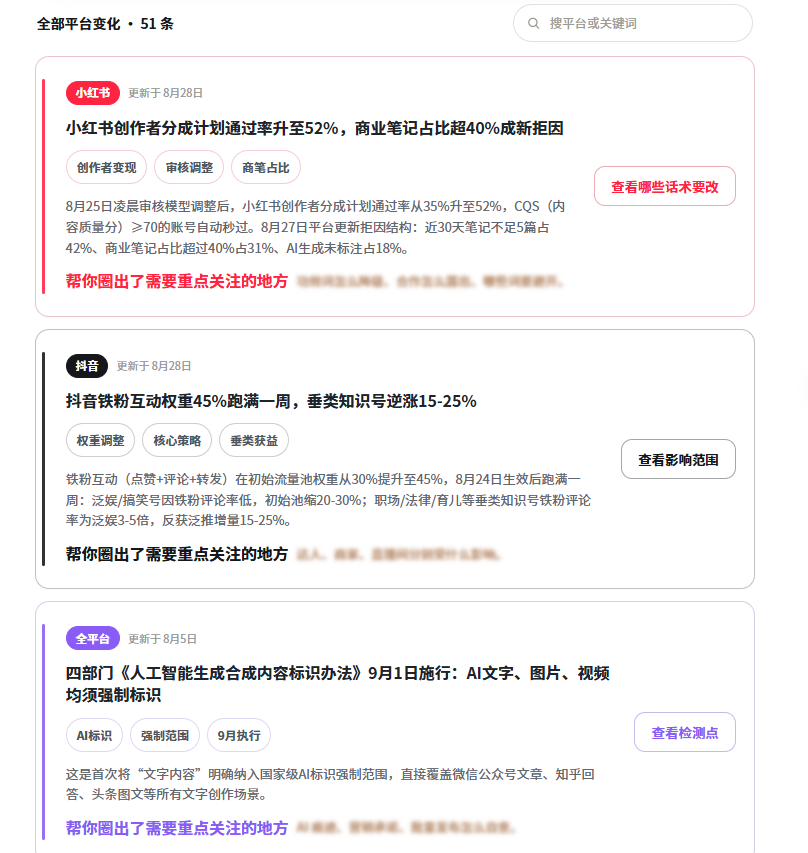

# 自媒体改稿避坑！告别生硬机器文风，轻松去 AI 味 

不少自媒体创作者在使用 AI 辅助写稿之后，都会遇到同一个难题：文案逻辑通顺、没有语病，可整体文风僵硬刻板，自带很重的**AI 痕迹**。很多人不停琢磨**AI 痕迹重怎么办**，尝试各种各样的改写办法，花费大量时间手动润色，最后的成品依旧缺少真人写作的松弛感，发布之后流量平平。

大部分新手踩坑的根源，就是用错了改写方式。单纯替换词语、调换段落顺序都只是表层修改，没办法真正**消除 AI 痕迹**。想要让文稿拥有自然真实的真人质感，需要从句式节奏、行文语感全方位打磨优化。

## 一、常见改写误区

在长期测评各类改写工具、看过上百份创作者稿件之后，我总结出大家最容易踩进去的几大误区，很多人日复一日重复错误操作，耗费大量时间却达不到**去 AI 味**的效果。

### 第一个误区，迷信同义词替换改写。

不管是用免费网页工具，还是自己手动逐词替换，本质上都只是换一套词语。

整篇文章的句子骨架、过渡逻辑、段落排布完全不变，机器写作的底层模式完整保留，改完看着文字不一样，内在的**AI 痕迹**丝毫没有减弱，付出的时间全部白费。

### 第二个误区，过度依赖免费工具当作主力。

网上不少开源项目被吹得神乎其神，但大多都有明显短板。

一部分需要本地部署代码、对接模型，普通自媒体博主没有技术基础，折腾半天也跑不起来；另一部分虽然可以运行，能力仅限于微调语气，只能软化个别句子，做不到整篇长文的语感重构。

拿来当辅助微调尚可，如果指望靠它完整**消除 AI 痕迹**就达不到预期。

### 第三个误区，寄希望于提示词一步到位。

不少创作者花大量时间打磨超长提示词，试图让 AI 直接写出完全真人化的稿件。

但大模型本身的训练逻辑就决定了，它会优先输出安全、工整、标准化的文本。就算提示词写得再细致，大批量产出时依旧会冒出大量模板套话，只能轻微改善，无法彻底摆脱**AI 痕迹**。

### 第四个误区，改稿只改开头结尾，忽略中间主体段落。

很多人知道开头结尾机器感重，会花心思修改，但是文章中间大段干货直接原封不动保留。AI 的模板句式大量藏在正文中间，只修改首尾，整篇稿件的**去 AI 味**依旧做不到位，发布之后依旧容易出现流量低迷。

## 二、小橡皮 AI 改稿优势

试过大量工具、踩完各类坑之后，我现在日常主力使用的就是小橡皮 AI，它做的是整篇文本的语感重构，针对性解决上面这些**AI 痕迹**问题。

传送门：[小橡皮https://xiangpiai\.cn](https://xiangpiai.cn/workspace?from=zhgxjw0818)

首先，它不会暴力篡改你的原文内容。很多改写工具为了追求表面效果，会乱改观点、删掉案例、改动数据。

小橡皮 AI 可以区分模板套话和你的原创干货，只去处理那些生硬的机器句式，在完成**消除 AI 痕迹**的同时守住你的原创内核，不用担心稿子被改崩废掉。

其次，它的改写改动全部可视化，支持自主调整。每一处做过修改的地方，都会附带对应的改写说明，我们可以清楚看到哪里被调整、为什么调整。

遇到不符合自己账号文风的句子，可以在线直接修改，不认可的改动也可以撤回，我们自己掌握稿件的最终走向，不会产出千篇一律的通稿，能够保留账号独有的表达风格。

另外自带的风控扫描，也是自媒体创作非常实用的加分项。很多创作者辛辛苦苦完成**消除 AI 痕迹**之后，却因为文稿里潜藏的违规、营销类用词出现流量问题。

小橡皮 AI 可以同步扫描全文风险表述，给出优化方向，提前规避限流、权重下滑的状况，改写和合规检查可以一次性做完。

工具本身网页端直接打开即可使用，不用下载软件，不用学习代码部署，零基础也可以上手。

不管是写几百字短笔记，还是几千字长干货，单篇更新或者矩阵批量打磨稿件，都可以拿来用，大幅压缩人工改稿消耗的时间\~

## 三、**AI 味**有哪些具体表现

想要解决**AI 痕迹重怎么办**，还得学会识别稿件里的**AI 味**，看得懂问题在哪，后续改写才有方向。

很多朋友分辨不出来，以为只是自己文笔不好，实际上是机器文本自带的特征。

**第一，过渡套话泛滥成灾。**文中频繁出现制式衔接语句，不管上下文需不需要，都会堆砌各类总结、转折类套话，行文充满报告感，真人写内容很少会频繁使用这类标准化连接话术。

**第二，句式高度工整对称。**句子的长度十分接近，排比句式扎堆出现，长句短句缺少交错。真人写作会有长有短，时而简洁、时而展开，不会每一段、每一组句子都保持整齐划一。

**第三，内容偏向空泛，缺少个人视角。**整篇都是通用性道理，没有亲身经历、没有小小的个人吐槽、没有真实的细节感受。放在任何一个同赛道账号都可以直接用，看不出属于 “你” 的思考，这就是很重的**AI 痕迹**。

**第四，情绪过于平淡中立。**通篇没有偏向，没有感慨，既不会肯定也不会适度吐槽，永远保持绝对客观。普通人写分享类内容，一定会带上自己的好恶与体会，而机器输出习惯规避主观情绪。

**第五，段落篇幅过于平均。**每一个段落行数差不多，不会出现有的段落很短、有的段落展开很长的情况。真人写文想到哪里写到哪里，段落会疏密错落，不会刻意控制每一段的字数。

当你的稿件出现上面多种特征，哪怕没有错别字、逻辑完整，也需要好好做**去 AI 味**，把这些机器化的表达调整成更贴合真人的状态。

## 四、最后总结

总的来说，想要做好**去 AI 味**、**消除 AI 痕迹**，一定要避开各类无效改写误区。同义词替换、盲目折腾开源工具、单纯依赖提示词、只修改首尾段落，这些做法都很难真正解决**AI 痕迹重怎么办**的痛点。

我们也要学会识别稿件当中典型的**AI 味**表现，看懂套话、工整句式、空洞内容、中立无情绪、段落平均这些信号，才知道改稿要朝着什么方向调整。

小橡皮 AI 的价值，就是帮我们跳过低效的人工打磨，从句式节奏层面重构文本，同时保护原创内容，还附带合规风险排查。

但工具也不是点完就万事大吉，我自己的习惯是，工具改写完成后，简单通读一遍，少量加入一点自己的真实感悟，再确认风控扫描结果，定稿之后再发布\~

